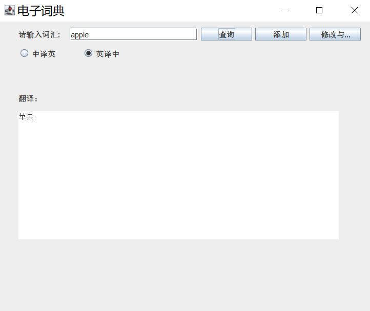
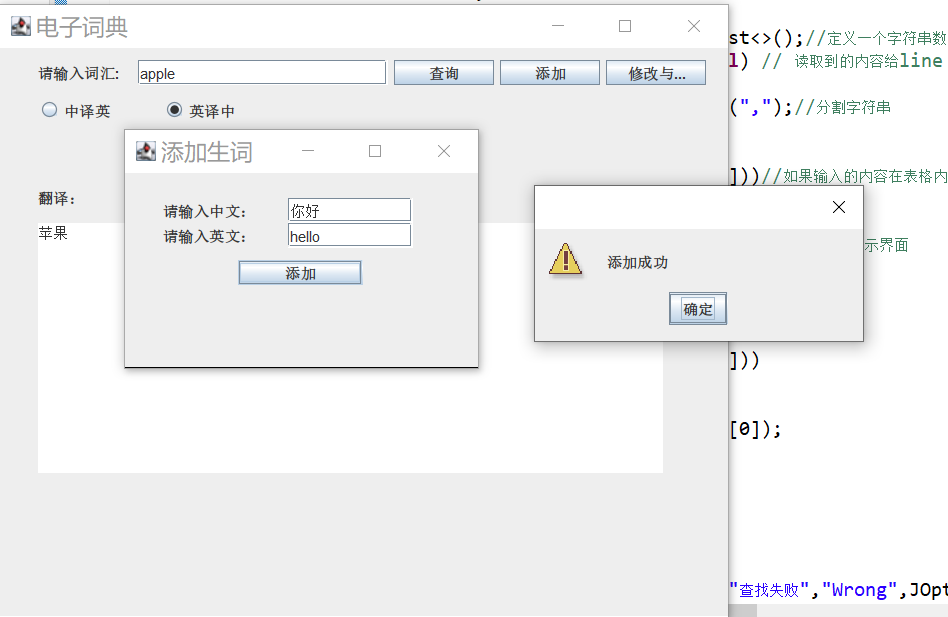
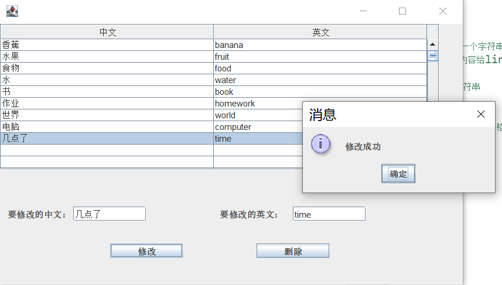
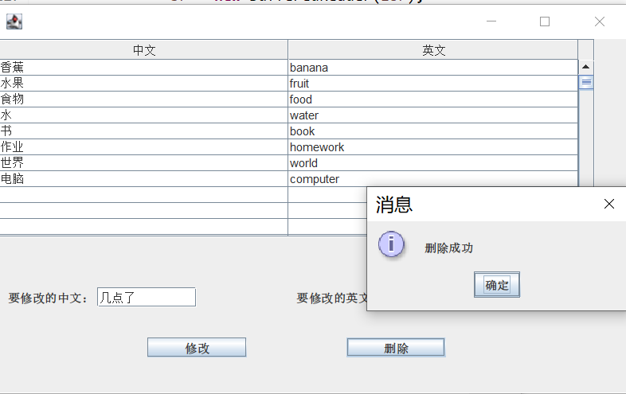

# 实现一个电子英汉词典 设计报告

## 功能说明

1. 实现英译中&中译英； 
2. 可以对查出的单词意思进行修改；
3. 可以对字典中的单词进行删除操作；
4. 实现生词本功能，用户可自主选择将生词保存起来，形成新文件；
5. 点进修改与删除界面可以看到当前所有单词表，可通过选中行进行删改

## 类的功能说明

1. javaDictionary
- 继承自JFrame
- 用于设计主面板布局和各按钮触发功能
- 按钮：查询(调用do_button_actionPerformed方法)、添加（调用AddWin()外部类）、修改和删除（调用DelWin()外部类

2. AddWin
- 继承自JFrame
- 用于设计添加生词本界面和实现功能

3. DelWin
- 继承自JFrame
- 用于设计修改和删除界面并实现修改与删除功能（调用内部updatecsv和delcsv方法）

## 方法的功能说明

1. do_button_actionPerformed
- 用来响应按钮单击事件。在该方法中完成对单词的查询操作，并根据不同的情况进行提示


## 涉及知识点阐述
- 如面向对象、集合、异常处理、线程，图形用户界面，或者 I/O 流等

### 图形用户界面
- 使用import javax.swing.*;和import java.awt.*;包
- 使用举例：
1. 创建组件
- 使用JFrame框架
```java
    private JLabel prompt;//输入提示信息
	private JTextField textfield;//输入查询内容
	private JButton chaxun;//点击查询按钮
	private JButton add;//添加单词按钮
	private JButton delete;//删除单词按钮
	private JPanel contentPane;//窗口面板容器
	private JRadioButton c1;//选择中译英
	private JRadioButton c2;//选择英译中
	private ButtonGroup group;//单选
	private JLabel fanyi;//翻译提示信息
	private JTextArea textarea;//翻译结果

    prompt = new JLabel("请输入词汇:");
	textfield = new JTextField();
	chaxun = new JButton("查询");
	add = new JButton("添加");
	delete = new JButton("修改与删除");
	c1 = new JRadioButton("中译英");
	c2 = new JRadioButton("英译中");
	group = new ButtonGroup();
	fanyi = new JLabel("翻译：");
	textarea = new JTextArea();

    //将组件添加到面板容器类
	contentPane.add(prompt);
	contentPane.add(textfield);
	contentPane.add(chaxun);
	contentPane.add(add);
	contentPane.add(delete);
	contentPane.add(c1);
	contentPane.add(c2);
	group.add(c1);
	group.add(c2);
	contentPane.add(fanyi);
	contentPane.add(textarea);
```
2. 指定布局
- 本次设计中部分采用绝对布局，部分采用BorderLayout
```java
    contentPane = new JPanel();
    //contentPane.setBorder(new EmptyBorder(5, 5, 5, 5));
    contentPane.setLayout(null);
    setContentPane(contentPane);
	setTitle("电子词典");
	setDefaultCloseOperation(JFrame.EXIT_ON_CLOSE);
	setBounds(200, 200, 600, 500);//(x坐标,y坐标,宽,高)

    //设置组件布局
	prompt.setBounds(30, 10, 80, 20);
	textfield.setBounds(110, 10, 200, 20);
	chaxun.setBounds(315, 10, 80, 20);
	add.setBounds(400, 10, 80, 20);
	delete.setBounds(485, 10, 80, 20);
	c1.setBounds(30, 30, 100, 40);
	c2.setBounds(130,30,100,40);
	fanyi.setBounds(30, 70, 100, 100);	
	textarea.setBounds(30, 140, 500, 200);
```
3. 响应事件
- 设定鼠标点击按钮是时的事件监听器
```java
    //查询按钮点击触发事件
	chaxun.addActionListener(new ActionListener() {
		public void actionPerformed(ActionEvent e) {
            do_button_actionPerformed(e);
        }
	});		
```
### 流程控制语句
- 使用举例：实现翻译功能时对于中译英和英译中的选择
```java
    List<String> allString = new ArrayList<>();//定义一个字符串数组
	while ((line = br.readLine()) != null) // 读取到的内容给line
	{
	    String[] information =line.split(",");//分割字符串
	    if(c1.isSelected())//中译英
	    {
	        if(text.equals(information[0]))//如果输入的内容在表格内
	        {
	        	textarea.setText("");//清空界面
	        	textarea.setText(information[1]);//显示界面
	        	ist=true;
	        }
	    }	
	    else//英译中
	    {	if(text.equals(information[1]))
	        {
	        	textarea.setText("");
	        	textarea.setText(information[0]);
	        	ist=true;
	        }
	    }
	    allString.add(line);
	}
```
### 数组
- 使用举例：修改词典时讲修改词汇中英文以数组存入
```java
    list.get(rowNum)[0] = chinese;//单元格写入中文
	list.get(rowNum)[1] = meaning;
	BufferedWriter writer = new BufferedWriter(new FileWriter(new File(path)));
	for (int i = 0; i < list.size(); i++) {
		for (int j = 0; j < list.get(i).length; j++) {
			writer.write(list.get(i)[j].toString() + ",");
			if (j == list.get(i).length - 1) {
				writer.newLine();
			}
		}
	}
```

### 异常处理
- 设计中多次使用try...catch异常处理结构
- 使用举例：查找单词对应翻译时，如果单词不存在则提示查找失败
```java
try {
	List<String> allString = new ArrayList<>();//定义一个字符串数组
	while ((line = br.readLine()) != null) // 读取到的内容给line
	{
	    String[] information =line.split(",");//分割字符串
	    if(c1.isSelected())//中译英
	    {
	        if(text.equals(information[0]))//如果输入的内容在表格内
	        {
	            textarea.setText("");//清空界面
	        	textarea.setText(information[1]);//显示界面
	        	ist=true;
	        }
	    }	
	    else//英译中
	    {	if(text.equals(information[1]))
	        {
	        	textarea.setText("");
	        	textarea.setText(information[0]);
	        	ist=true;
	        }
	    }
	    allString.add(line);
	}
	if(!ist)//表格中不存在  
	    JOptionPane.showMessageDialog(null, "查找失败","Wrong",JOptionPane.WARNING_MESSAGE);//显示不存在信息
	} catch (IOException e1) {
	    e1.printStackTrace();
    }
```
### 工具类
- 本次设计中主要使用ArrayList
- 调用java.util.ArrayList;和java.util.List;
```java
    List<String[]> list = new ArrayList<>();
    try {
		BufferedReader reader = new BufferedReader(new FileReader(new File(path)));//读取源文件
		while ((inString = reader.readLine()) != null) {//将原文件信息加入数组
		    list.add(inString.split(","));
		}
		reader.close();
		list.get(rowNum)[0] = chinese;//单元格写入中文
		list.get(rowNum)[1] = meaning;
		BufferedWriter writer = new BufferedWriter(new FileWriter(new File(path)));
		for (int i = 0; i < list.size(); i++) {
			for (int j = 0; j < list.get(i).length; j++) {
				writer.write(list.get(i)[j].toString() + ",");
				if (j == list.get(i).length - 1) {
					writer.newLine();
				}
			}
		}
		writer.close();
	}
```

### I/O流
- 调用java.io.*;
- 本次设计中对于文件的读写采用字符流，类型包括过滤与缓冲
- 使用举例：
```java
    String path = System.getProperty("user.dir")+"\\src\\wordfile.csv";//获取表格路径(工作目录+文件所在位置)
	InputStream fis;
	InputStreamReader isr = null;
	try {
	    fis = new FileInputStream(path);//文件字节流
	    try {
	        isr = new InputStreamReader(fis,"gbk");//字节流转换为字符流
	    } catch (UnsupportedEncodingException e1) {
	        // TODO Auto-generated catch block
	        e1.printStackTrace();
	    }
```

## 运行效果

1. 翻译


2. 添加生词


3. 修改


4.删除


## 代码展示
```java
package finaltest;

import javax.swing.*;
import javax.swing.table.DefaultTableModel;

import java.awt.*;
import java.awt.event.*;
import java.io.*;
import java.util.ArrayList;
import java.util.List;


public class javaDictionary extends JFrame{
	private static final long serialVersionUID = 2990172158355874031L;//序列化
	private JLabel prompt;//输入提示信息
	private JTextField textfield;//输入查询内容
	private JButton chaxun;//点击查询按钮
	private JButton add;//添加单词按钮
	private JButton delete;//删除单词按钮
	private JPanel contentPane;//窗口面板容器
	private JRadioButton c1;//选择中译英
	private JRadioButton c2;//选择英译中
	private ButtonGroup group;//单选
	private JLabel fanyi;//翻译提示信息
	private JTextArea textarea;//翻译结果
	
	public static void main(String[] args) {
		javaDictionary frame = new javaDictionary();
        frame.setVisible(true);//显示图形化用户界面
   }
	
	public javaDictionary() {//初始化
		
		contentPane = new JPanel();
        //contentPane.setBorder(new EmptyBorder(5, 5, 5, 5));
        contentPane.setLayout(null);
        setContentPane(contentPane);
		setTitle("电子词典");
		setDefaultCloseOperation(JFrame.EXIT_ON_CLOSE);
		setBounds(200, 200, 600, 500);//(x坐标,y坐标,宽,高)
		
		prompt = new JLabel("请输入词汇:");
		textfield = new JTextField();
		chaxun = new JButton("查询");
		add = new JButton("添加");
		delete = new JButton("修改与删除");
		c1 = new JRadioButton("中译英");
		c2 = new JRadioButton("英译中");
		group = new ButtonGroup();
		fanyi = new JLabel("翻译：");
		textarea = new JTextArea();
		
		//设置组件布局
		prompt.setBounds(30, 10, 80, 20);
		textfield.setBounds(110, 10, 200, 20);
		chaxun.setBounds(315, 10, 80, 20);
		add.setBounds(400, 10, 80, 20);
		delete.setBounds(485, 10, 80, 20);
		c1.setBounds(30, 30, 100, 40);
		c2.setBounds(130,30,100,40);
		fanyi.setBounds(30, 70, 100, 100);	
		textarea.setBounds(30, 140, 500, 200);
		
		//将组件添加到面板容器类
		contentPane.add(prompt);
		contentPane.add(textfield);
		contentPane.add(chaxun);
		contentPane.add(add);
		contentPane.add(delete);
		contentPane.add(c1);
		contentPane.add(c2);
		group.add(c1);
		group.add(c2);
		contentPane.add(fanyi);
		contentPane.add(textarea);
		
		//查询按钮点击触发事件
		chaxun.addActionListener(new ActionListener() {
			public void actionPerformed(ActionEvent e) {
                do_button_actionPerformed(e);
            }
		});		
		
		add.addActionListener(new ActionListener() {

			@Override
			public void actionPerformed(ActionEvent e) {
				// TODO Auto-generated method stub
				new AddWin();
			}	
			
		});
		delete.addActionListener(new ActionListener() {

			@Override
			public void actionPerformed(ActionEvent e) {
				// TODO Auto-generated method stub
				new DelWin();
			}
			
		});
	}
	//编写do_button_actionPerformed()方法，用来响应按钮单击事件。在该方法中完成对单词的查询操作，并根据不同的情况进行提示。
	protected void do_button_actionPerformed(ActionEvent e) {
	        String text = textfield.getText();// 获得用户输入的单词
	        if (text==null) {// 如果用户输入为空则提示用户
	            JOptionPane.showMessageDialog(null,"请输入要查询的单词","Wrong",JOptionPane.WARNING_MESSAGE);
	            return;
	        }
	        else {
	        	String path = System.getProperty("user.dir")+"\\src\\wordfile.csv";//获取表格路径(工作目录+文件所在位置)
	        	InputStream fis;
	        	InputStreamReader isr = null;
	        	try {
	        		fis = new FileInputStream(path);//文件字节流
	        		try {
	        			isr = new InputStreamReader(fis,"gbk");//字节流转换为字符流
	        		} catch (UnsupportedEncodingException e1) {
	        			// TODO Auto-generated catch block
	        			e1.printStackTrace();
	        		}
	        	} catch (FileNotFoundException e2) {
	        		// TODO Auto-generated catch block
	        		e2.printStackTrace();
	        	}
	        	BufferedReader br = null;
	        	br = new BufferedReader(isr);
	        	String line ="";
	        	boolean ist=false;
	        	try {
	        		List<String> allString = new ArrayList<>();//定义一个字符串数组
	        		while ((line = br.readLine()) != null) // 读取到的内容给line
	        		{
	        			String[] information =line.split(",");//分割字符串
	        			if(c1.isSelected())//中译英
	        			{
	        				if(text.equals(information[0]))//如果输入的内容在表格内
	        					{
	        					textarea.setText("");//清空界面
	        					textarea.setText(information[1]);//显示界面
	        					ist=true;
	        					}
	        			}	
	        			else//英译中
	        			{	if(text.equals(information[1]))
	        				{
	        				textarea.setText("");
	        				textarea.setText(information[0]);
	        				ist=true;
	        				}
	        			}
	        			allString.add(line);
	        		}
	        		if(!ist)//表格中不存在  
	        		JOptionPane.showMessageDialog(null, "查找失败","Wrong",JOptionPane.WARNING_MESSAGE);//显示不存在信息
	        	} catch (IOException e1) {
	        		e1.printStackTrace();
	        	}
	        }
	    }
	
	class AddWin extends JFrame implements ActionListener{
			private JLabel message1;//提示输入中文
			private JLabel message2;//提示输入英文
			private JTextField chinese;//输入中文
			private JTextField english;//输入英文
			private JButton tianjia;//点击添加按钮
			private JPanel contentPane;//主要窗口面板容器
			
			public AddWin() {
				contentPane = new JPanel();
				contentPane.setLayout(null);
		        setContentPane(contentPane);
		        this.setTitle("添加生词");		        
		        this.setVisible(true);//窗口可视
				this.setBounds(300, 300, 300, 200);
		        
		        message1 = new JLabel("请输入中文：");
		        message2 = new JLabel("请输入英文：");
		        chinese = new JTextField();
		        english = new JTextField();
		        tianjia = new JButton("添加");
		        
		        message1.setBounds(30, 20, 100, 20);
		        message2.setBounds(30, 40, 100, 20);
		        chinese.setBounds(130, 20, 100, 20);
		        english.setBounds(130, 40, 100, 20);
		        tianjia.setBounds(90, 70, 100, 20);
		        
		        contentPane.add(message1);
		        contentPane.add(message2);
		        contentPane.add(chinese);
		        contentPane.add(english);
		        contentPane.add(tianjia);
		        
		        tianjia.addActionListener(new ActionListener() {
					@Override
					public void actionPerformed(ActionEvent e) {
						// TODO Auto-generated method stub
						String path = System.getProperty("user.dir")+"\\src\\difficult.csv";
						File csv = new File(path);
						BufferedWriter bw = null;//缓冲区
					    String name=chinese.getText();
					    String meaning=english.getText(); 
					    if(name.equals(" ")||meaning.equals(" "))
					    	JOptionPane.showMessageDialog(null, "添加不能为空", "",JOptionPane.WARNING_MESSAGE);
					    else {
					    	try {
					    		bw = new BufferedWriter(new FileWriter(csv,true));//如果append参数为true，则将字节写入文件末尾处;如果append参数为false, 则写入文件开始处。
					    		//bw = new BufferedWriter(new OutputStreamWriter(new FileOutputStream(new File(path)),"gbk"));
					    		bw.write(name+","+meaning);
					    		bw.newLine(); 
					    		bw.close(); 
					    		JOptionPane.showMessageDialog(null, "添加成功", "",JOptionPane.WARNING_MESSAGE);
					    	}catch(IOException e1) {					    		
					    	}	    	
					    }
					}		        	
		        });
			}
			
			@Override
			public void actionPerformed(ActionEvent e) {
				// TODO Auto-generated method stub
				
			}
		}
	
	class DelWin extends JFrame implements ActionListener{
		public JTextField chinese;//输入中文
		public JTextField english;//输入英文
		public JButton xiugai;//修改按钮
		public JButton shanchu;//删除按钮
		public JPanel centermain;//窗口面板容器
		public DefaultTableModel model;//表格模型
		public JTextField aTextField, bTextField;//输入框
		public JLabel atishi,btihshi;//提示语
		
		
		
		public DelWin() {
			centermain = new JPanel();
			centermain.setLayout(null);//默认位置
			this.setLayout(new BorderLayout());	
			
			
			//组件初始化
			atishi=new JLabel("要修改的中文：");
			btihshi=new JLabel("要修改的英文：");
			aTextField=new JTextField();
			bTextField=new JTextField();
			xiugai=new JButton("修改");
			shanchu=new JButton("删除");
			
			
			//设置组件布局
			xiugai.setBounds(150,300,100,20);
			shanchu.setBounds(350,300,100,20);	
			aTextField.setBounds(100,250,100,20);
			bTextField.setBounds(400,250,100,20);	
			atishi.setBounds(10,250,100,20);	
			btihshi.setBounds(300,250,100,20);	
			
			
			//将组件加入
			centermain.add(xiugai);
			centermain.add(shanchu);
			centermain.add(aTextField);
			centermain.add(bTextField);	
			centermain.add(atishi);	
			centermain.add(btihshi);		
			
			
	        String[] columns = {"中文","英文"};//列名
	        Object[][] data = null;//数据
	    	String path=System.getProperty("user.dir")+"\\src\\wordfile.csv";
	    	InputStream fis;
	    	InputStreamReader isr = null;
	    	try {
	    		fis = new FileInputStream(path);
	    		try {
	    			isr = new InputStreamReader(fis,"gbk");
	    		} catch (UnsupportedEncodingException e1) {
	    			// TODO Auto-generated catch block
	    			e1.printStackTrace();
	    		}
	    	} catch (FileNotFoundException e2) {
	    		// TODO Auto-generated catch block
	    		e2.printStackTrace();
	    	}
	    	BufferedReader br= null;  	
	    	br = new BufferedReader(isr);
	    	String line ="";
	    	boolean ist=false;
	    	int i=-1;
	    	try {
	    		List<String> allString = new ArrayList<>();		
	    		data = new Object[1000][2];
	    		while ((line = br.readLine()) != null) 
	    		{
	                 i=i+1;
	                 String[] information =line.split(",");				
					 data[i][0]=information[0]; 
					 data[i][1]=information[1];
	    		}

	    	} catch (IOException e1) {
	    		e1.printStackTrace();
	    	}
	    	  
	    	model = new DefaultTableModel(data, columns);//设置模型
	        JTable table = new JTable(model);//将模型加入到表格
	        JScrollPane scrollPane = new JScrollPane(table);//加入滚动条
	        table.setFillsViewportHeight(true);// 设置充满布局      
	        scrollPane.setBounds(0, 0, 600, 200);	
	        centermain.add(scrollPane);//表格和滚动条加入主要面板容器
	        this.add(centermain,BorderLayout.CENTER);
	        this.setSize(650, 400);
	        this.setVisible(true);//可视
	        
	        xiugai.addActionListener(new ActionListener() {
				@Override
				public void actionPerformed(ActionEvent e) {
					// TODO Auto-generated method stub
					int selectedRow = table.getSelectedRow();//获取被选中行的索引
					if(selectedRow != -1) {
						model.setValueAt(aTextField.getText(), selectedRow, 0);//修改第一列的值
						model.setValueAt(bTextField.getText(), selectedRow, 1);
						updatecsv(selectedRow,aTextField.getText(),bTextField.getText());//更新文档
						JOptionPane.showMessageDialog(null, "修改成功");
					}
				}

				private void updatecsv(int rowNum, String chinese, String meaning) {
					// TODO Auto-generated method stub
					System.out.println(rowNum+" "+chinese+" "+meaning);
				  	String path=System.getProperty("user.dir")+"\\src\\wordfile.csv";
					String inString ="";
					List<String[]> list = new ArrayList<>();
					try {
						BufferedReader reader = new BufferedReader(new FileReader(new File(path)));//读取源文件
						while ((inString = reader.readLine()) != null) {//将原文件信息加入数组
							list.add(inString.split(","));
						}
						reader.close();
						list.get(rowNum)[0] = chinese;//单元格写入中文
						list.get(rowNum)[1] = meaning;
						BufferedWriter writer = new BufferedWriter(new FileWriter(new File(path)));
						for (int i = 0; i < list.size(); i++) {
							for (int j = 0; j < list.get(i).length; j++) {
								writer.write(list.get(i)[j].toString() + ",");
								if (j == list.get(i).length - 1) {
									writer.newLine();
								}
							}
						}
						writer.close();
					}catch(FileNotFoundException ex) {
						
					}catch(IOException ex) {
						
					}
				}
	        					
	        });
	        shanchu.addActionListener(new ActionListener() {
	            public void actionPerformed(ActionEvent e) {
	                int selectedRow = table.getSelectedRow();
	                if (selectedRow != -1) {
	                    model.removeRow(selectedRow);
	                    delcsv(selectedRow);
	                    JOptionPane.showMessageDialog(null, "删除成功");
	                    
	                }
	            }

				private void delcsv(int rowNum) {
					// TODO Auto-generated method stub
					String path=System.getProperty("user.dir")+"\\src\\wordfile.csv";
					String inString ="";
					List<String[]> list = new ArrayList<>();
					int k=-1;
					try {
						BufferedReader reader = new BufferedReader(new FileReader(new File(path)));//
						while ((inString = reader.readLine()) != null) {
							k=k+1;
							if(k!=rowNum)
							list.add(inString.split(","));
						}
						reader.close();
						BufferedWriter writer = new BufferedWriter(new FileWriter(new File(path)));
						for (int i = 0; i < list.size(); i++) {
							for (int j = 0; j < list.get(i).length; j++) {
								writer.write(list.get(i)[j].toString() + ",");
								if (j == list.get(i).length - 1) {
									writer.newLine();
								}
							}
						}
						writer.close();
					} catch (FileNotFoundException ex) {
						
					} catch (IOException ex) {
						
					}
				}
	            
	            
	        });
		}
		
		@Override
		public void actionPerformed(ActionEvent e) {
			// TODO Auto-generated method stub
			
		}
	}
}
```

## 总结

- 这次设计作业基于曾经的一次实验题目展开，更多的功能实现让我将所学过的零碎的知识点系统的串起来并合理使用，对于java这门面向对象的编程语言有了更深刻的理解和更好的掌握。虽然在编写代码的过程中遇到了各种各样的困难，但最终都通过网络搜索和课件搜索解决了，还学会了课本例子和实验中未曾用到过的内容，培养了自主学习的能力，收益颇丰。